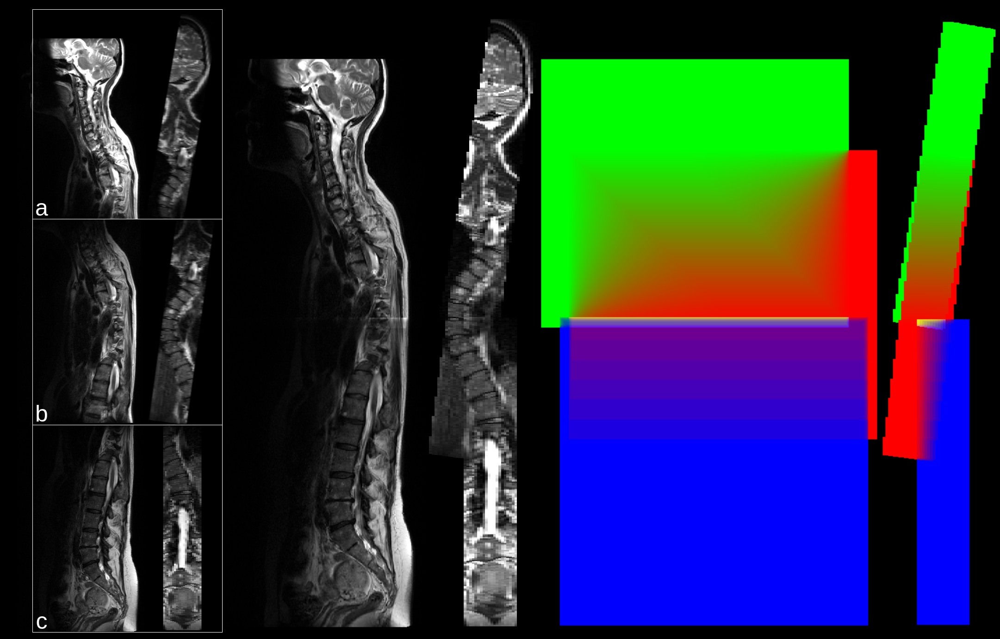
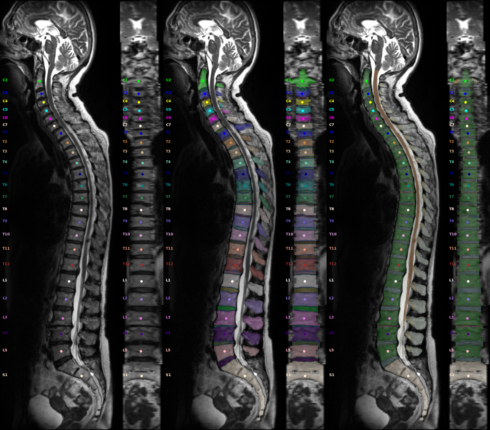
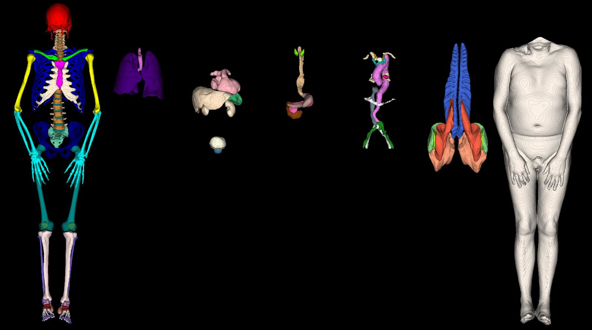

<h1 align="center">

</h1><br>


[](https://pypi.python.org/pypi/tptbox/)
[](https://pypi.org/project/tptbox/)
[](https://pypi.python.org/pypi/tptbox/)
[](https://github.com/Hendrik-code/TPTBox/actions/workflows/tests.yml)
[](https://codecov.io/gh/Hendrik-code/TPTBox)
[](https://opensource.org/licenses/Apache-2.0)


The Torso Processing ToolBox (TPTBox) is a multi-functional package to handle any sort of bids-conform dataset (CT, MRI, ...)
It can find, filter, search any BIDS_Family and subjects, and has many functionalities, among them:
- Easily loop over datasets, and the required files
- Read, Write Niftys, centroid jsons, ...
- Reorient, Resample, Shift Niftys, Centroids, labels
- Modular 2D snapshot generation (different views, MIPs, ...)
- 3D Mesh generation from segmentation and snapshots from them
- Registration
- Logging everything consistently
- ...

## Install the package
```bash
conda create -n 3.10 python=3.10
conda activate 3.10
pip install TPTBox
# Optional dependency Registration
pip install hf-deepali
```
### Install via github:
(you should be in the project folder)
```bash
pip install poetry
poetry install
```
or:
Develop mode is really, really nice:
```bash
pip install poetry
poetry install --with dev
```

## Functionalities

Each folder in this package represents a different functionality.

The top-level-hierarchy incorporates the most important files, the BIDS_files.

### BIDS_Files

This file builds a data model out of the BIDS file names.
It can load a dataset as a BIDS_Global_info file, from which search queries and loops over the dataset can be started.
See ```tutorial_BIDS_files.ipynb``` for details.

### bids_constants
Defines constants for the BIDS nomenclature (sequence-splitting keys, naming conventions...)

### vert_constants

Contains definitions and sort order for our intern labels, for vertebrae, POI, ...

### Rotation and Resampling

Example rotate and resample.

```python
from TPTBox import NII

nii = NII.load("...path/xyz.nii.gz", seg=True)
# R right, L left
# S superior/up, I inferior/down
# A anterior/front, P posterior/back
img_rot = nii.reorient(axcodes_to=("P", "I", "R"))
img_scale = nii.rescale((1.5, 5, 1))  # in mm as currently rotated
# resample to an other image
img_resampled_to_other = nii.resample_from_to(img_scale)

nii.get_array()  # get numpy array
nii.affine  # Affine matrix
nii.header  # NIFTY header
nii.orientation  # Orientation in 3-Letters
nii.zoom # Scale of the three image axis
nii.shape #shape
```
### Stitching
Python function and script for arbitrary image stitching. [See Details](TPTBox/stitching/)


### Spineps and Points of Interests (POI) integration


For our Spine segmentation pipline follow the installation of [SPINEPS](https://github.com/Hendrik-code/spineps).
Image Source: Rule-based Key-Point Extraction for MR-Guided Biomechanical Digital Twins of the Spine; 


SPINEPS will produce two mask: instance and semantic labels. With these we can compute our POIs. There are either center of mass points or surface points with bioloical meaning. See [Validation of a Patient-Specific Musculoskeletal Model for Lumbar Load Estimation Generated by an Automated Pipeline From Whole Body CT](https://pubmed.ncbi.nlm.nih.gov/35898642/)
```python
from TPTBox import NII, POI, Location, POI_Global, calc_poi_from_subreg_vert
from TPTBox.core.vert_constants import v_name2idx
from TPTBox.segmentation.spineps import run_spineps_single

# This requires that spineps is installed
output_paths = run_spineps_single(
    "file-path-of_T2w.nii.gz",
    model_semantic="t2w",
    ignore_compatibility_issues=True,
)
out_spine = output_paths["out_spine"]
out_vert = output_paths["out_vert"]
semantic_nii = NII.load(out_spine, seg=True)
instance_nii = NII.load(out_vert, seg=True)

poi = calc_poi_from_subreg_vert(
    instance_nii,
    semantic_nii,
    subreg_id=[
        Location.Vertebra_Full,
        Location.Arcus_Vertebrae,
        Location.Spinosus_Process,
        Location.Costal_Process_Left,
        Location.Costal_Process_Right,
        Location.Superior_Articular_Left,
        Location.Superior_Articular_Right,
        Location.Inferior_Articular_Left,
        Location.Inferior_Articular_Right,
        # Location.Vertebra_Corpus_border, CT only
        Location.Vertebra_Corpus,
        Location.Vertebra_Disc,
        Location.Muscle_Inserts_Spinosus_Process,
        Location.Muscle_Inserts_Transverse_Process_Left,
        Location.Muscle_Inserts_Transverse_Process_Right,
        Location.Muscle_Inserts_Vertebral_Body_Left,
        Location.Muscle_Inserts_Vertebral_Body_Right,
        Location.Muscle_Inserts_Articulate_Process_Inferior_Left,
        Location.Muscle_Inserts_Articulate_Process_Inferior_Right,
        Location.Muscle_Inserts_Articulate_Process_Superior_Left,
        Location.Muscle_Inserts_Articulate_Process_Superior_Right,
        Location.Ligament_Attachment_Point_Anterior_Longitudinal_Superior_Median,
        Location.Ligament_Attachment_Point_Posterior_Longitudinal_Superior_Median,
        Location.Ligament_Attachment_Point_Anterior_Longitudinal_Inferior_Median,
        Location.Ligament_Attachment_Point_Posterior_Longitudinal_Inferior_Median,
        Location.Additional_Vertebral_Body_Middle_Superior_Median,
        Location.Additional_Vertebral_Body_Posterior_Central_Median,
        Location.Additional_Vertebral_Body_Middle_Inferior_Median,
        Location.Additional_Vertebral_Body_Anterior_Central_Median,
        Location.Ligament_Attachment_Point_Anterior_Longitudinal_Superior_Left,
        Location.Ligament_Attachment_Point_Posterior_Longitudinal_Superior_Left,
        Location.Ligament_Attachment_Point_Anterior_Longitudinal_Inferior_Left,
        Location.Ligament_Attachment_Point_Posterior_Longitudinal_Inferior_Left,
        Location.Additional_Vertebral_Body_Middle_Superior_Left,
        Location.Additional_Vertebral_Body_Posterior_Central_Left,
        Location.Additional_Vertebral_Body_Middle_Inferior_Left,
        Location.Additional_Vertebral_Body_Anterior_Central_Left,
        Location.Ligament_Attachment_Point_Anterior_Longitudinal_Superior_Right,
        Location.Ligament_Attachment_Point_Posterior_Longitudinal_Superior_Right,
        Location.Ligament_Attachment_Point_Anterior_Longitudinal_Inferior_Right,
        Location.Ligament_Attachment_Point_Posterior_Longitudinal_Inferior_Right,
        Location.Additional_Vertebral_Body_Middle_Superior_Right,
        Location.Additional_Vertebral_Body_Posterior_Central_Right,
        Location.Additional_Vertebral_Body_Middle_Inferior_Right,
        Location.Additional_Vertebral_Body_Anterior_Central_Right,
        Location.Ligament_Attachment_Point_Flava_Superior_Median,
        Location.Ligament_Attachment_Point_Flava_Inferior_Median,
        Location.Vertebra_Direction_Posterior,
        Location.Vertebra_Direction_Inferior,
        Location.Vertebra_Direction_Right,
    ],
)
poi = poi.round(2)
print("Vertebra T4 Vertebra Corpus Center of mass:", poi[v_name2idx["T4"], Location.Vertebra_Corpus])
print("The id number of T4 Vertebra_Corpus is ", v_name2idx["T4"], Location.Vertebra_Corpus.value)

# rescale/reorante local poi like nii
poi_new = poi.reorient(("P", "I", "R")).rescale((1, 1, 1))
# Local and global POIs can be rescaled to a target spacing with:
poi_new = poi.resample_from_to(other_nii_or_poi)

# local to global poi
global_poi = poi.to_global(itk_coords=True)
# You can save global pois in mrk.json format for import and editing in slicer.
global_poi.save_mrk("FILE.mrk.json", glyphScale=3.0)
# Import as a Markup in slicer; To make points editable you must click on the "lock" symbol under Markups - Control Points - Interaction

# Save in our format:
poi.save(poi_path)
# Loading local/global Poi
poi = POI.load(poi_path)
poi = POI_Global.load(poi_path)


```


### Snapshot2D Spine

The snapshot function automatically generates sag, cor, axial cuts in the center of a segmentation.

```python
from TPTBox.spine.snapshot2D import Snapshot_Frame, create_snapshot

ct = Path("Path to CT")
mri = Path("Path to MRI")
vert = Path("Path to Vertebra segmentation")
subreg = Path("Path to Vertebra subregions")
poi_ct = Path("Path to Vertebra poi")
poi_mr = Path("Path to Vertebra poi")

ct_frame = Snapshot_Frame(image=ct, segmentation=vert, centroids=poi_ct, mode="CT", coronal=True, axial=True)
mr_frame = Snapshot_Frame(image=mri, segmentation=vert, centroids=poi_mr, mode="MRI", coronal=True, axial=True)
create_snapshot(snp_path="snapshot.jpg", frames=[ct_frame, mr_frame])
```


### Snapshot3D

Requires additonal python packages: vtk fury xvfbwrapper

```python
from TPTBox.mesh3D.snapshot3D import make_snapshot3D, make_snapshot3D_parallel

# all segmentation; view give the rotation of an image
make_snapshot3D("sub-101000_msk.nii.gz", "snapshot3D.png", view=["A", "L", "P", "R"])
# Select witch segmentation per panel are chosen.
make_snapshot3D("sub-101000_msk.nii.gz", "snapshot3D_v2.png", view=["A"], ids_list=[[1, 2], [3]])
# we proviede a implementation to process multiple images at the same time.
make_snapshot3D_parallel(["a.nii.gz", "b.nii.gz"], ["snp_a.png", "snp_b.png"], view=["A"])
```

<!---
### Logger

```python
TBD
```

### Point registration with POIs
```python
TBD
```


> [!Note]
> Notably, ...

> [!TIP]
> A Tip

> [!IMPORTANT]
> Importantly
-->