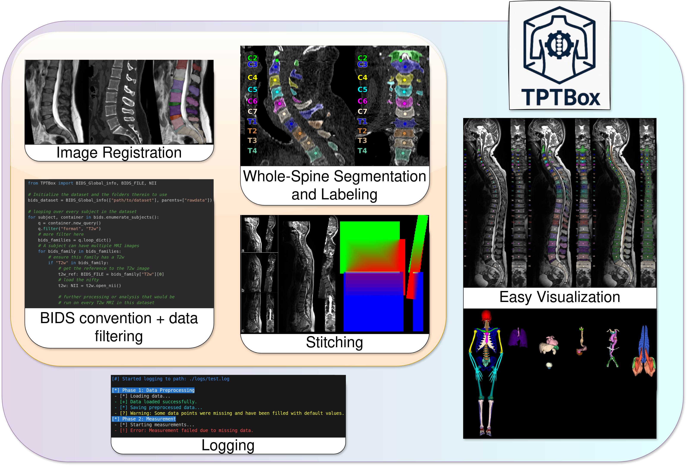

<h1 align="center">

</h1><br>


[](https://pypi.python.org/pypi/tptbox/)
[](https://pypi.org/project/tptbox/)
[](https://pypi.python.org/pypi/tptbox/)
[](https://github.com/Hendrik-code/TPTBox/actions/workflows/tests.yml)
[](https://codecov.io/gh/Hendrik-code/TPTBox)
[](https://tptbox.readthedocs.io/en/latest/)
[](https://opensource.org/licenses/Apache-2.0)

<p align="center">
  <a href="#quick-use">Quick use</a> ·
  <a href="https://tptbox.readthedocs.io">Documentation</a> ·
  <a href="CONTRIBUTING.md">Contributing</a>
</p>


The Torso Processing ToolBox (TPTBox) is a multi-functional package to handle any sort of bids-conform dataset (CT, MRI, ...)

## Features

- **Dataset Handling**: Loop over datasets, search query, and find images and their corresponding derivatives


- **I/O Handling**: Read and Write nifti files and point coordinate files as JSONs
- **Image Processing**: Reorient, Resample, Shift Niftys, Centroids, labels, compute connected components, and so much more
- **Visualization**: Modular 2D snapshot generation (different views, maximum intensity projections, depth-color map)
- **3D Mesh generation**: Use 3D segmentations to create 3D meshes and then take snapshots for visualization
- **Registration**: Register two images to each other, using available data (image, segmentation, points)
- **Stitching**: You have multiple MRI of the same person, split into different regions? Use our stitching algorithm to create one unified view.
- **Logger**: Log every function in a file automatically, color important messages in the terminal for easy recognition.


## Install the package
```bash
conda create -n 3.10 python=3.10
conda activate 3.10
pip install TPTBox
# Optional dependency Registration
pip install hf-deepali
```
### Install via github:
(you should be in the project folder)
```bash
pip install poetry
poetry install
```
or:
Develop mode is really, really nice:
```bash
pip install poetry
poetry install --with dev
```


### Quick Use:
```python
from TPTBox import NII

nii = NII.load("...path/xyz.nii.gz", seg=True)
# R right, L left
# S superior/up, I inferior/down
# A anterior/front, P posterior/back
img_rot = nii.reorient(axcodes_to=("P", "I", "R"))
img_scale = nii.rescale((1.5, 5, 1))  # in mm as currently rotated
# resample to an other image
img_resampled_to_other = nii.resample_from_to(img_scale)

nii.get_array()  # get numpy array
nii.affine  # Affine matrix
nii.header  # NIFTY header
nii.orientation  # Orientation in 3-Letters
nii.zoom # Scale of the three image axis
nii.shape #shape
```


## Documentation

Full API reference and usage guides are available at **https://tptbox.readthedocs.io**.

The docs cover all sub-packages — `NII`, `POI`, `BIDS_FILE`, NumPy utilities,
vertebra constants, spine analysis, registration, segmentation, mesh3D,
stitching, and the logger — with hyperlinks back to the GitHub source.

## The three pillars

### <a href=TPTBox/core/README_NII.md>NII: nii_wrapper.py -- NIfTI image wrapper </a>
This is the core of image handling, this takes care of loading images and segmentations, and any data processing

### <a href=TPTBox/core/README_POI.md>POI: poi.py -- Points of Interests </a>
This is the core of handling 2D/3D coordinates in any defined space. Center of mass locations can be computed in this format, and other landmarks. Similar to Niftis, this contains an affine matrix so it is aware of its global space relation, voxel spacing, ...

### <a href=TPTBox/core/README_BIDS.md>BIDS: bids_files.py -- Dataset Handling </a>
This is the core of handling datasets that are BIDS-compliant. Easily search through your datasets and find all images following your constraints, such as every CT that also has a specific segmentation available.

## Modules

Each sub-package has its own README with API tables and examples. Click on the name to get the corresponding README with quick examples and more explanations.


| Module | Description |
|---|---|
| [`core`](https://tptbox.readthedocs.io/en/latest/modules/core/) | `NII` (NIfTI I/O and transforms), `POI` (anatomical landmarks), BIDS dataset navigation, NumPy utilities, vertebra constants |
| [`core/poi_fun`](https://tptbox.readthedocs.io/en/latest/modules/poi_fun/) | Internal POI computation strategies (surface points, corpus centers, disc points) |
| [`spine`](https://tptbox.readthedocs.io/en/latest/modules/spine/) | Spine-specific tools: 2D snapshot generation and statistical measurements |
| [`spine/snapshot2D`](https://tptbox.readthedocs.io/en/latest/modules/snapshot2d/) | Modular 2D image generation — axial/sagittal/coronal slices, MIPs, segmentation overlays |
| [`spine/spinestats`](https://tptbox.readthedocs.io/en/latest/modules/spinestats/) | Clinical spine measurements: distances, angles, disc heights, IVD landmarks |
| [`registration`](https://tptbox.readthedocs.io/en/latest/modules/registration/) | Rigid and deformable image registration via ANTs and DeepALI |
| [`segmentation`](https://tptbox.readthedocs.io/en/latest/modules/segmentation/) | Integration with SPINEPS, VibeSeg/TotalVibeSeg, and nnU-Net pipelines |
| [`mesh3D`](https://tptbox.readthedocs.io/en/latest/modules/mesh3d/) | 3D surface mesh generation and rendering from segmentation volumes |
| [`stitching`](https://tptbox.readthedocs.io/en/latest/modules/stitching/) | Multi-station NIfTI stitching for whole-body or long-spine acquisitions |
| [`logger`](https://tptbox.readthedocs.io/en/latest/modules/logger/) | Structured, consistent logging for medical image processing pipelines |


# Publications

An incomplete list of publications that actively used TPTBox:

1. **Denoising diffusion-based MRI to CT image translation enables automated spinal segmentation**; Graf, Robert;
Schmitt, Joachim; Schlaeger, Sarah; Möller, Hendrik Kristian; Sideri-Lampretsa, Vasiliki; Sekuboyina, Anjany; Krieg, Sandro Manuel;
Wiestler, Benedikt; Menze, Bjoern; Rueckert, Daniel; Kirschke, Jan; **European Radiology Experimental, 2023**

2. **Modeling the acquisition shift between axial and sagittal MRI for di usion super-resolution to enable axial spine segmentation**; Graf, Robert; Möller, Hendrik; McGinnis, Julian; Rühling, Sebastian; Weihrauch, Maren; Atad, Matan; Shit,
Suprosanna; Menze, Bjoern; Mühlau, Mark; Paetzold, Johannes C.; Rueckert, Daniel; Kirschke, Jan S.; **Proceedings of Machine Learning Research, 2024**

3. **Detecting unforeseen data properties with diffusion autoencoder embeddings using spine MRI data**; Graf, Robert; Hunecke, Florian; Pohl, Soeren; Atad, Matan; Möller, Hendrik; Starck, Sophie; Kröncke, Thomas; Bette, Stefanie; Bamberg,
Fabian; Pischon, Tobias; Niendorf, Thoralf; Schmidt, Carsten; Paetzold, Johannes C.; Rueckert, Daniel; Kirschke, Jan S.; **International Conference on Medical Image Computing and Computer-Assisted Intervention (MICCAI), 2024**

4. **SPINEPS—automatic whole spine segmentation of T2-weighted MR images using a two-phase approach to multi-class semantic and instance segmentation**; Möller, Hendrik; Graf, Robert; Schmitt, Joachim; Keinert-Weth, Benjamin;
Schön, Hanna; Atad, Matan; Sekuboyina, Anjany; Streckenbach, Felix; Kofler, Florian;
Kroencke, Thomas; Bette, Stefanie; Willich, Stefan N.; Keil, Thomas; Niendorf, Thoralf;
Pischon, Tobias; Endemann, Beate; Menze, Bjoern; Rueckert, Daniel; Kirschke, Jan S.;
**European Radiology, 2025**

5. **VIBESegmentator: full body MRI segmentation for the NAKO and UK Biobank**;
Graf, Robert; Platzek, Paul; Riedel, Evamaria Olga; Ramschütz, Constanze; Starck, Sophie; Möller, Hendrik K.; Atad, Matan; Völzke,
Henry; Bülow, Robin; Schmidt, Carsten Oliver; Rüdebusch, Julia; Jung, Matthias; Reisert, Marco; Weiss, Jakob; Lö ler, Maximilian T.;
Bamberg, Fabian; Wiestler, Benedikt; Paetzold, Johannes C.; Rueckert, Daniel; Kirschke, Jan S.; **European Radiology, 2025**

6. **Generating synthetic high-resolution spinal STIR and T1w images from T2w FSE and low-resolution axial Dixon**; Graf, Robert; Platzek, Paul-Sören; Riedel, Evamaria Olga; Kim, Su Hwan; Lenhart, Nicolas; Ramschütz, Constanze; Paprottka,
Karolin Johanna; Kertels, Olivia Ruriko; Möller, Hendrik Kristian; Atad, Matan; Bülow, Robin; Werner, Nicole; Völzke, Henry; Schmidt,
Carsten Oliver; Wiestler, Benedikt; Paetzold, Johannes C.; Rueckert, Daniel; Kirschke, Jan S.; **European Radiology, 2025**

7. **MAGO-SP: detection and correction of water-fat swaps in magnitude-only VIBE MRI**;
Graf, Robert; Möller, Hendrik; Starck, Sophie; Atad, Matan; Braun, Philipp; Stelter, Jonathan; Peters, Annette; Krist, Lilian; Willich,
Stefan N.; Völzke, Henry; Bülow, Robin; Pischon, Tobias; Niendorf, Thoralf; Paetzold, Johannes C.; Karampinos, Dimitrios; Rueckert,
Daniel; Kirschke, Jan S.; **International Conference on Medical Image Computing and Computer-Assisted Intervention (MICCAI), 2025**

8. **Automated Thoracolumbar Stump Rib Detection and Analysis in a Large CT Cohort**;
Möller, Hendrik; Dima, Alina; Keinert-Weth, Benjamin; Graf, Robert; Atad, Matan; Paetzold,
Johannes; Jungmann, Friederike; Braren, Rickmer; Kofler, Florian; Menze, Bjoern; Rueckert,
Daniel; Kirschke, Jan S.; Schön, Hanna; **MDPI AI, 2026**

9. **PARASIDE: An automatic paranasal sinus segmentation and structure analysis tool for magnetic resonance imaging**; Möller, Hendrik;
Krautschick, Lukas; Graf, Robert; Atad, Matan; Busch, Chia-Jung; Beule, Achim Georg;
Scharf, Christian; Kaderali, Lars; Menze, Bjoern; Rueckert, Daniel; Kirschke, Jan S.;
Paperlein, Fabian; **Computers in Biology and Medicine, 2026**

10. **One Sequence to Segment Them All: Efficient Data Augmentation for CT and MRI Cross-Domain 3D Spine Segmentation;** Molinier,
Nathan*; Möller, Hendrik*; Dagonneau, Thomas; Curto-Vilalta, Anna; Graf, Robert; Atad,
Matan; Rueckert, Daniel; Kirschke, Jan S.; Cohen-Adad, Julien; **International Conference on
Medical Image Computing and Computer-Assisted Intervention (MICCAI) , 2026**

11. **VERIDAH: Solving Enumeration Anomaly Aware Vertebra
Labeling across Imaging Sequences;** Möller, Hendrik; Schön, Hanna; Graf, Robert;
Atad, Matan; Molinier, Nathan; Sekuboyina, Anjany; Budai, Bettina; Bamberg, Fabian;
Ringhof, Steffen; Schlett, Christopher; Pischon, Tobias; Niendorf, Thoralf; Decker, Josua;
Weber, Marc-André; Menze, Bjoern; Rueckert, Daniel; Kirschke, Jan S.; **European
Radiology (under review), 2026**

12. **Rule-based key-point extraction for MR-guided biomechanical digital twins of the spine**; Graf, Robert; Lerchl,
Tanja; Nispel, Kati; Möller, Hendrik; Atad, Matan; McGinnis, Julian; Watrinet, Julius Maria; Paetzold, Johannes C.; Rueckert, Daniel;
Kirschke, Jan S.; **International Workshop on Digital Twin for Healthcare (DT4H), 2025**

13. **VERPEX: Anatomical Landmark Extraction on 3D Vertebrae exploiting Segmentation Masks**; Möller, Hendrik; Wang, Alissa Yuxuan; Graf, Robert;
Nispel, Kati; Atad, Matan; Menze, Bjoern; Rueckert, Daniel; Kirschke, Jan S.; Lerchl, Tanja;
**International Workshop on Digital Twin for Healthcare (DT4H), 2026**
