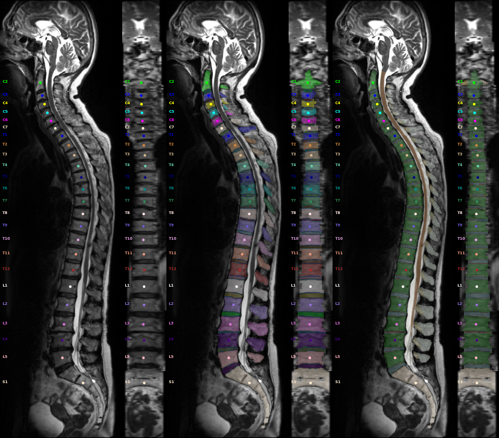

# 2D Snapshots (`spine/snapshot2D`)

Modular 2D image generation for NIfTI data.  Supports axial/sagittal/coronal slices,
maximum intensity projections (MIPs), and segmentation overlays.



## Key symbols

| Symbol | Module | Description |
|---|---|---|
| `create_snapshot` | `snapshot_modular.py` | Main entry point — renders a list of `Snapshot_Frame` objects to a PNG |
| `Snapshot_Frame` | `snapshot_modular.py` | Configuration for one image panel (image, overlay, view direction, …) |
| `Visualization_Type` | `snapshot_modular.py` | Enum selecting how a frame is rendered: `Slice`, `Maximum_Intensity`, `Mean_Intensity`, … |
| Pre-built templates | `snapshot_templates.py` | Ready-to-use snapshot configurations for common spine workflows |

## Example

```python
from TPTBox import to_nii
from TPTBox.spine.snapshot2D import Snapshot_Frame, create_snapshot

ct = to_nii("ct.nii.gz")
seg = to_nii("seg.nii.gz", seg=True)

# The views are boolean flags on the frame, and the output path comes first.
frames = [
    Snapshot_Frame(image=ct, segmentation=seg, mode="CT", sagittal=True),
    Snapshot_Frame(image=ct, mode="CT", sagittal=False, axial=True),
]
create_snapshot("output.png", frames)
```

More extensive:
```python
from pathlib import Path
from TPTBox import calc_poi_from_subreg_vert
from TPTBox.spine.snapshot2D import Snapshot_Frame, Visualization_Type, create_snapshot

path = Path("root")
img = path / "ct.nii.gz"
vert = path / "seg-vert_msk.nii.gz"
subreg = path / "seg-spine_msk.nii.gz"
out_path = path / "snp.jpg"
out_path2 = path / "snp2.jpg"
poi = calc_poi_from_subreg_vert(vert, subreg)
create_snapshot(
    out_path,
    [
        Snapshot_Frame(img, vert, poi, sagittal=True, coronal=True, mode="CT"),
        Snapshot_Frame(img, subreg, poi, sagittal=True, coronal=True, axial=True, mode="CTs", axial_heights=[0.20, 0.4, 0.6, 0.8]),
    ],
)
create_snapshot(
    out_path2,
    [
        Snapshot_Frame(
            img,
            subreg,
            poi,
            sagittal=True,
            coronal=True,
            mode="MINMAX",
            only_mask_area=True,
            hide_segmentation=True,
        ),
        Snapshot_Frame(
            img,
            subreg,
            poi,
            sagittal=True,
            coronal=True,
            mode="MINMAX",
            only_mask_area=True,
            visualization_type=Visualization_Type.Maximum_Intensity,
            hide_segmentation=True,
        ),
        Snapshot_Frame(
            img,
            subreg,
            poi,
            sagittal=True,
            coronal=True,
            mode="MINMAX",
            visualization_type=Visualization_Type.Maximum_Intensity,
            hide_segmentation=True,
        ),
    ],
)
```
